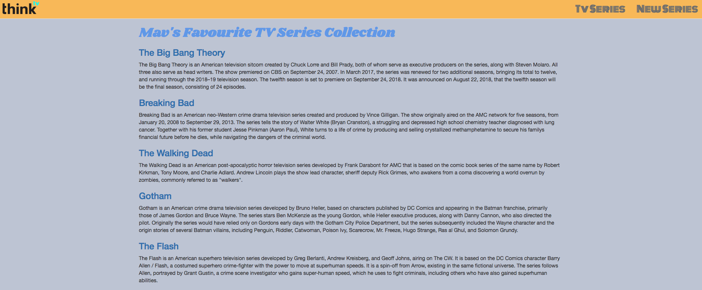
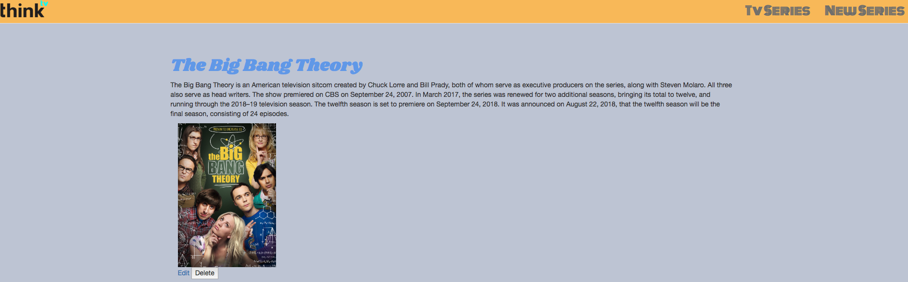

# Sinatra_Full stack Web app
## Requirements
- [x] Create a full stack web application using Ruby, Sinatra, Rack and Postgres
- [x] Must be a different resource to any previous resource that was used before
- [x] Must use Postgres to store, display and manipulate data; performing all necessary CRUD actions
- [x] Must use the 7 RESTful routes
- [x] Must create dynamic web pages using ERB
- [x] Must explore and use Static Assets such as CSS to make it look presentable.
BONUS

## Result

### Home screen

This is the home screen of the web application where the user is able to see the current list of the tv shows database

### Show one Tv series

This screen shows the description of the selected show from the home screen with images and options to edit and delete

### To add New Show
This section of the page shows the add new tv series feature of the web application, where the user is able to add to the database by completing the required fields.

### To edit the show

This edit feature allows the user to edit the fields of a selected show.

